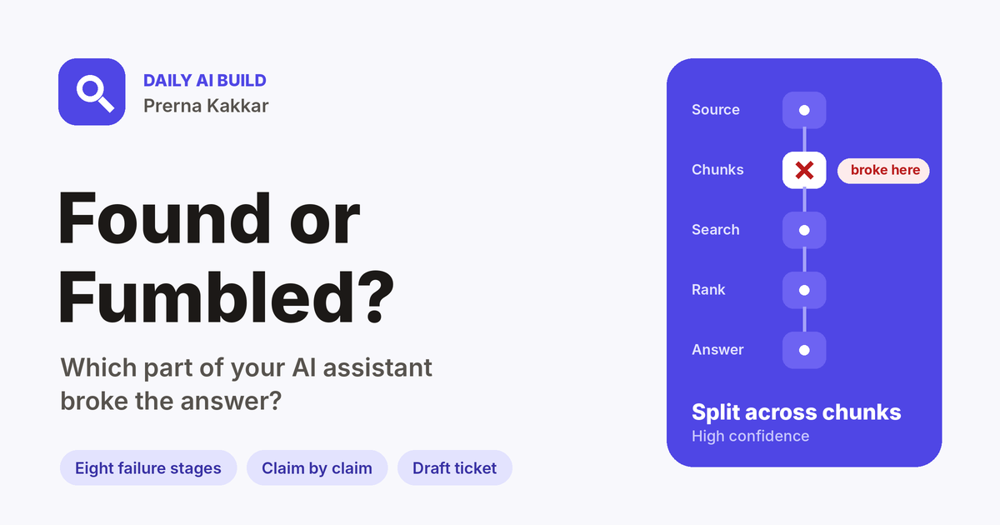

# Found or Fumbled?

**Your AI assistant gave a wrong answer. Which part broke?**

Live: [found-or-fumbled.vercel.app](https://found-or-fumbled.vercel.app)



Most AI help bots look something up before they answer. They split documents into chunks, search those chunks for the user's question, rank what comes back and write an answer from the top few. This setup is usually called retrieval-augmented generation, or RAG.

When a RAG answer is wrong, the first question is where it went wrong, and that question decides who fixes it. An out-of-date document is a content problem. A search that brought back the wrong chunks is a search problem. A model that had the right chunk and wrote something else is a prompt problem. Teams often skip this step and go straight to rewriting the prompt, which fixes nothing when the right text never reached the model.

Found or Fumbled? takes one bad answer and the chunks that search returned, and tells you which of eight stages most likely broke, with the evidence, checks you can run yourself, the likely fix and a draft ticket.

Part of my [daily AI builds](https://github.com/kakkarprerna/daily-ai-builds) series.

---

## Why I built it

At Jinn Live, our voice agent gave a wrong figure roughly once every 10 to 15 calls. We treated the first reports as one-offs. The cause turned out to be caching: the agent was answering from a previous version of the knowledge base. The prompt was fine and the search was fine; the agent was faithfully reading an old document. After that, nobody closed a hallucination report without first checking which version of the knowledge base the agent had used.

That check is the first of eight in this tool. The rest cover the other places a looked-up answer goes wrong, so a PM can arrive at an engineering conversation with the stage, the evidence and a ticket, instead of a screenshot and a guess.

## The eight stages

| Stage | Pipeline step | What it looks like | Fix owner |
|---|---|---|---|
| **Knowledge gap** | Knowledge base | The answer was never in the documents, and the assistant answered anyway | Content |
| **Stale or conflicting source** | Knowledge base | An old version of a document is still indexed and won | Content |
| **Split across chunks** | Chunking | The rule was cut in half, so the assistant saw only the first part | Search |
| **Retrieval miss** | Retrieval | The right content exists but search never brought it back | Search |
| **Ranked too low** | Ranking | The right chunk came back, below chunks that misled the answer | Search |
| **Ignored the context** | Answer writing | A chunk held the answer and the assistant contradicted it | Prompt |
| **Invented detail** | Answer writing | The answer adds numbers or promises that no chunk supports | Prompt |
| **Wrongly refused** | Answer writing | A chunk held the answer and the assistant deflected | Prompt |

## What you get

| | |
|---|---|
| **Verdict** | The most likely stage, a confidence level, and up to two stages that contributed |
| **Pipeline view** | The five steps of the pipeline with the broken one marked |
| **Claim by claim** | Every claim in the answer, marked supported, contradicted or unsupported, with the chunk it traces to |
| **Cheap checks** | Things to confirm without engineering, each with the result that would confirm the verdict |
| **Likely fix** | What to change, and whether it belongs to content, search, prompt or product |
| **What would flip it** | The finding that would move the verdict to a different stage |
| **Draft ticket** | Title and body, ready to copy into Jira or Linear |
| **Text checks** | A second, rule-based reading that updates as you type and is compared with the model verdict |

## How it works

1. **Paste the bad answer.** The user's question, the assistant's reply and, ideally, what it should have said.
2. **Add what search returned.** The chunks in rank order, separated by `---`. An optional first line in brackets carries the source, date and score: `[source: billing-terms.md | updated: 2026-03-10 | score: 0.84]`. Most RAG tools show this in a trace or debug view.
3. **Tick a few facts.** Whether the answer exists in the knowledge base, whether the source changed recently, what looks wrong and how many chunks search returns. "Not sure" is fine; every chip row also takes your own option.
4. **Diagnose.** The model reads everything, plus the text checks, and replies with the verdict and the rest.

### Two readings, side by side

Before any model runs, the browser compares words and numbers across the question, the answer, the expected answer and the chunks. It looks for numbers in the answer that appear in no chunk, chunks that stop mid-sentence, the same document retrieved with two dates, and how much of the expected answer each chunk covers. A short list of fixed rules turns those signals into a **text lean**, printed in full under Method.

The model verdict is then compared with the text lean. When they agree, you can move faster. When they don't, the app says so, and the cheap checks become the deciding step. I wanted a model and a set of plain rules checking each other, rather than one model marking its own work.

## Three worked examples

Each loads with a saved diagnosis, so the app works without an API key. Companies, documents and figures are invented; the failure patterns are ones I have seen in real assistant work.

| Example | What happens | Verdict |
|---|---|---|
| **Health insurer: the retired waiting period** | The old dental guide is still indexed, ranks first, and the bot quotes 6 months instead of 3 | Stale or conflicting source |
| **SaaS billing: the refund rule cut in half** | The chunk ends at "in the following case:" and the condition that makes it a no never came back | Split across chunks |
| **Telco roaming: 60 minutes from nowhere** | The bot adds 60 minutes of calls to a data-only pass. The number appears in no chunk | Invented detail |

## Model providers

| Provider | Key |
|---|---|
| **Muse Glimmer** (default) | Free to try on the site owner's key via NVIDIA's endpoint. Visitors can paste their own NVIDIA key instead |
| **Anthropic** | Bring your own key |
| **OpenAI** | Bring your own key |
| **Gemini** | Bring your own key |

The model runs at temperature 0 and replies in tagged lines such as `VERDICT|CHUNK|High|...` and `CLAIM|...|Unsupported|none`. A broken line is skipped rather than sinking the whole result, and swapping providers needs no parser changes.

## Privacy

- No sign-in, no database, nothing stored. Closing the tab clears everything.
- Text leaves the browser only when you press **Diagnose**, and only to the provider you picked.
- A pasted key travels with that one request and is never saved or logged.
- The prompt and the site owner's key live in a serverless function, never in the browser bundle.

## Limits

- It only sees the chunks you paste. Whether a document exists elsewhere in the knowledge base is something you confirm yourself, and the verdict says so when that is the deciding question.
- Word matching misses paraphrase, synonyms and other languages, so a low coverage score can mean different wording rather than missing content.
- One bad answer is one data point. Run the checks and a few similar questions before calling it a pattern.
- The verdict is a model reading evidence. It is the first lead to confirm, and it never replaces looking at the trace.

## Run it locally

```bash
npm install
npm run dev          # the interface only; the examples and text checks work without the API
npx vercel dev       # interface plus the /api/diagnose function
```

Copy `.env.example` to `.env.local` and set `LLM_BASE_URL`, `LLM_MODEL` and `LLM_API_KEY` for Muse Glimmer. Model names for the other providers can be overridden with `ANTHROPIC_MODEL`, `OPENAI_MODEL` and `GEMINI_MODEL`.

## Project layout

```
found-or-fumbled/
├── api/diagnose.js     serverless function: prompt, provider routing, size limits
├── src/lib.js          chunk parsing, word and number signals, text-lean rules, tagged-line parser
├── src/examples.js     the three worked examples with saved results
├── src/App.jsx         interface: Start here, Diagnose, The eight stages, Examples, Method
├── src/styles.css
├── public/og-image.png link preview
└── vercel.json         rebuilds only when this folder changes
```

## Built with

React and Vite, deployed on Vercel. I designed and directed the build with AI coding tools: the stage taxonomy, the text-lean rules, the worked examples and the interface decisions are mine.

---

Prerna Kakkar · Senior Product Manager · [GitHub](https://github.com/kakkarprerna)
