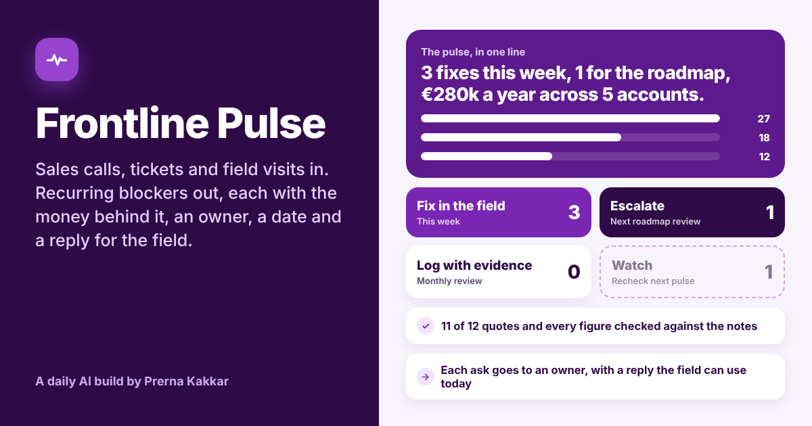

# Frontline Pulse

**Paste notes from sales calls, support tickets, customer success or shop visits. Get the problems that keep coming up, how many accounts and how much money each one touches, who owns the fix, when it is due, and what the field should say to customers today.**

[Live app](https://frontline-pulse.vercel.app) · Three worked examples run without a key



---

## The problem

The people closest to customers usually know what is broken weeks before anyone else. A rep hears "no single sign-on, no contract" on three calls. A customer success manager watches a fourth go-live slip while a WhatsApp template waits for approval. A field rep drives promotion stock to a shop himself because the pallet arrived four days late.

That knowledge tends to get stuck in one of three places. It sits in call notes nobody reads across. It reaches product as "a customer said", from whichever rep was loudest that week. Or it gets acted on, but nobody tells the field, so they stop writing it down.

Frontline Pulse is the step between the notes and the Monday meeting. It groups the notes into signals, counts the accounts and money behind each one from the figures in the notes, sends each signal to the team that can fix it with a date attached, and writes the message that tells the field what to say in the meantime.

## What it does

You paste the notes, say where they came from and what period they cover. Name the account on each note and, if you know it, the deal or order value.

| | |
| --- | --- |
| **Signals** | 3 to 7 recurring blockers, each with every mention, the account behind it, its value as written and a quote checked word for word against your notes |
| **Score** | Checked accounts × severity × stage, worked out in the open on every signal |
| **Lanes** | Every signal in one of four: Fix in the field (this week), Escalate (next roadmap review), Log with evidence (monthly review) or Watch |
| **Owners** | Routed by the kind of fix it needs: Product, Engineering, Enablement, Operations, Marketing or Revenue leadership. Override any of them |
| **Value at stake** | A yearly figure from the values in your notes, with monthly order values turned into yearly ones and each account counted once |
| **Workaround time** | Hours the field spends working around each problem, from editable starting assumptions |
| **Asks by owner** | One concrete ask per signal, grouped by team, with a due window and a link to the evidence |
| **Field brief** | A message for the field: what to say now on each signal, who is behind it and what to keep listening for. Plus a full Markdown digest |
| **Change the call** | Disagree with a stage, a severity, a fix or an owner? Click a different chip and the routing moves |

## The design choice that matters

**A model listens. Rules route.** Asked "what should we fix first?", a model tends to weigh the most vivid note, the same way a meeting does. So the model here only groups the notes, labels each signal from fixed word lists and copies out the mentions. Counting accounts, adding up money, scoring, choosing the lane and naming the owner all happen in the browser with printed rules.

The rules also check the model. Every quote is searched for in your notes. A mention whose quote is not there does not count, and neither does its value. Every figure has to appear in the notes as written. In the first worked example, one quote about Okta is a paraphrase rather than a copy, so Brisa Retail's €61k drops out of the single sign-on signal and the total falls from €277k to €216k.

This is the same split as So What?, Wrong Turn and Who Says Yes? in this repo.

## How the routing is worked out

| Rule | What it does |
| --- | --- |
| **M1** | Every mention's quote is searched for in your notes, ignoring case, spacing and quote marks. A quote that is not found does not count |
| **M2** | Accounts are counted once per signal |
| **V1** | A value counts only if that figure appears in the notes as written |
| **V2** | Monthly values are multiplied by 12. Each account counts at its highest checked value |
| **V3** | Totals count each account once across all signals |
| **S1** | Score = checked accounts × severity (Annoyance 1, Slows down 2, Blocks 3) × stage (Day-to-day use 1, Getting started 2, Winning the deal 3, Renewal or reorder 3) |
| **L1** | Fewer than 2 checked accounts goes to Watch. If it blocks a deal or renewal with a checked value, it is flagged for one more call this week |
| **L2** | Score under 6 goes to Watch |
| **L3** | Train, Change process, Message and Price go to Fix in the field |
| **L4** | Build and Fix scoring 12 or more go to Escalate |
| **L5** | Build and Fix scoring 6 to under 12 go to Log with evidence |
| **R1** | Owner by fix: Build to Product, Fix to Engineering, Train to Enablement, Change process to Operations, Message to Marketing, Price to Revenue leadership |
| **T1** | Workaround hours = checked mentions × hours per workaround (Minutes 0.25 h, Hours 2 h by default) |

Watch signals also say what would move them, for example "one more account raising it" or "4 accounts at this severity would escalate it".

## Where the numbers come from

Every euro figure is one you wrote in your notes. Nothing is estimated or benchmarked. Deal values are taken as yearly, and values written per month are multiplied by 12. The workaround hours per occurrence are **starting assumptions I set for illustration**, editable on the Who acts page, and they only count mentions that were written down and checked. Field replies are drafted by the model from your notes, so any fact in them (a date, a margin, a hosting location) should be checked before the message goes out. The app says this next to the message.

## The three worked examples

| Example | Notes | What it shows |
| --- | --- | --- |
| **Deals stuck at IT review** (B2B SaaS, Iberia sales team) | Six weeks of sales call notes across seven accounts | Single sign-on escalated to product, three field fixes, and a paraphrased quote removing €61k from the count |
| **Go-lives slipping, renewals at risk** (conversational AI, customer success) | A month of CSM notes and support tickets | Operations owning the biggest delay, two renewals escalating a missing report, and a €150k pilot flagged from a single account |
| **Promotions without stock** (food producer, field sales) | Two weeks of shop visit reports | Monthly order values turned into yearly figures, and a Build signal logged rather than escalated until more shops ask |

Companies, people and numbers in the examples are invented.

## Model and keys

The default model is Meta's Muse Glimmer 30B on NVIDIA's free endpoint, running on this site's key, held in a serverless function and never sent to the browser. Visitors can switch to Anthropic, OpenAI or Gemini with their own key, which is sent once with the request and never stored. The prompt also lives in the function. Output comes back as tagged lines rather than JSON, which keeps the provider swap cheap.

## Run it locally

```bash
npm install
npx vercel dev
```

Set these environment variables for the default model:

```
LLM_BASE_URL=https://integrate.api.nvidia.com/v1
LLM_MODEL=<Muse Glimmer model id>
LLM_API_KEY=<your NVIDIA key>
```

Without them, the worked examples still run, and visitors can bring their own key.

## Stack

React and Vite, deployed on Vercel. One serverless function (`api/pulse.js`). The quote and figure checks, scoring, lanes, routing, value totals, field message and digest export live in `src/pulse.js`. Icons from Lucide.

---

Part of [Daily AI Builds](../) by Prerna Kakkar.
