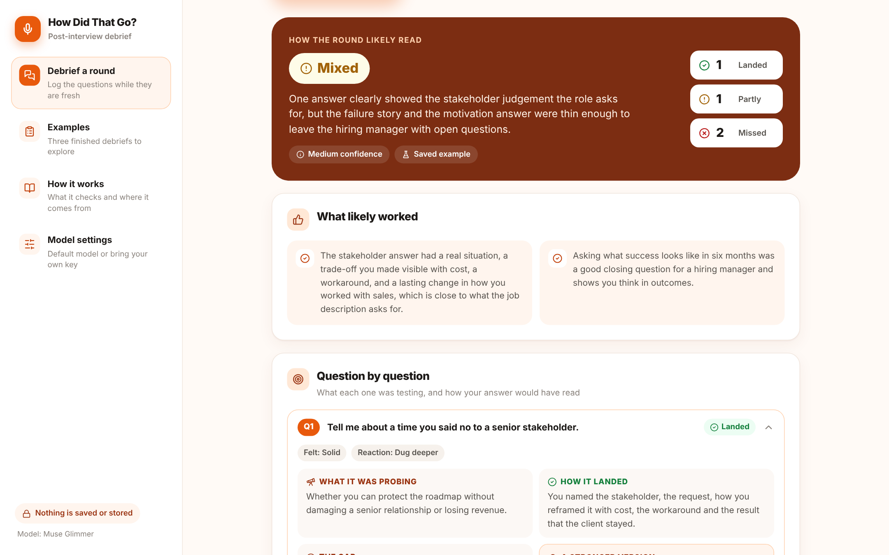

# How Did That Go?

**A post-interview debrief for candidates.** You note the questions you were asked and what you said. It tells you what each question was really testing, how your answer probably came across, where it fell short, and what to fix before the next round.

**Live app:** https://how-did-that-go.vercel.app



---

## Why I built this

Most interview prep happens before the interview. The most useful hour is the one straight after it, when you still remember the exact questions and the moment an answer went sideways. Most people spend that hour replaying the awkward bits and learn very little from it.

Every interview question is checking for something specific. "Tell me about a launch that failed" is about ownership. "Why do you want to work here?" is about whether you did your homework. Once you can see the probe behind a question, a vague feeling of "that went badly" turns into one or two concrete fixes.

This is part of my daily AI builds series. It sits next to [Loop Ready](../loop-ready), which helps you prepare for each stage of a hiring process. How Did That Go? covers the other side: learning from each round once it is over.

## What you get back

| Section | What it tells you |
|---|---|
| **How the round likely read** | Strong, Mixed or Needs work, with a confidence level and a one-line summary |
| **What likely worked** | The answers worth keeping, tied to what you actually said |
| **Question by question** | What each question was probing, whether your answer landed, the specific gap, and a stronger version you can reuse |
| **Signals in your notes** | Four fixed checks run in the browser: a result mentioned, a real example, your own part made clear, enough detail |
| **Patterns** | What repeats across your answers, good and bad |
| **Fix before the next round** | Three to five actions in priority order |
| **Follow-up note** | A short thank-you note you can send, which can quietly add the point you missed |
| **The next round will probably test** | What to prepare for, given how this round went |
| **What this cannot know** | The limits of a debrief built only from your own notes |

## Try it without typing anything

Open **Examples** in the sidebar. There are three invented rounds, already debriefed:

1. **Senior PM, hiring manager round** at a payments scale-up. Strong on stakeholders, weak on the failure story and "why us". *Mixed.*
2. **Product designer, portfolio panel** at a healthtech startup. Great walkthrough, then a blank on how success was measured. *Strong.*
3. **Customer success manager, recruiter screen** at an enterprise SaaS firm. A five-minute introduction, a salary figure given too early, an unknown notice period. *Needs work.*

Each one opens the full debrief and fills the form, so you can change an answer and run it again.

## How it works

1. You log the round (role, stage, interviewer, format, optional job description) and each question with a short note of what you said, how it felt and how the interviewer reacted. Chips cover the common options and every row lets you add your own.
2. A serverless function sends that to an AI model briefed as an experienced interview coach. The prompt lives on the server, never in the browser.
3. The model replies in plain tagged lines (`READ|`, `Q|2|GAP|`, `FIX|` and so on), which the app parses into cards. Tagged lines are easier for smaller models to follow than JSON, and they make switching providers cheap.
4. Separately, four fixed rules check your notes in the browser. No model is involved and every rule is printed in **How it works** inside the app.

### Guardrails in the prompt

- Every judgement must cite something you actually wrote. No invented details.
- The interviewer's reaction is treated as a weak signal. Moving on quickly can mean satisfied or unconvinced.
- It never predicts the outcome or claims to know what the interviewer thought.
- With a job description, probes and fixes are tied to its requirements.
- The follow-up note stays under 110 words and never re-sells the whole CV.

## Models

| Option | Who pays | Notes |
|---|---|---|
| **Meta Muse Glimmer 30B** (default) | App owner's key, server side | Runs on NVIDIA's free OpenAI-compatible endpoint. Visitors need nothing. |
| **Anthropic** | Visitor's own key | Default model `claude-sonnet-5-5`, editable |
| **OpenAI** | Visitor's own key | Default model `gpt-5-mini`, editable |
| **Gemini** | Visitor's own key | Default model `gemini-2.5-flash`, editable |

A visitor's key stays in the browser tab, goes with that single request, and is never stored or logged.

## Privacy

No sign-in, no database, no analytics. Notes are sent to the model for one request and are not kept by the app. The app suggests leaving out interviewer names and anything confidential you were told.

## Run it locally

```bash
npm install
cp .env.example .env.local   # add your NVIDIA key
npx vercel dev               # runs the app and the /api function together
```

`npm run dev` works for the interface and the saved examples. Live debriefs need `vercel dev` so the serverless function runs.

### Environment variables

| Variable | Example |
|---|---|
| `LLM_BASE_URL` | `https://integrate.api.nvidia.com/v1` |
| `LLM_MODEL` | the Muse Glimmer model id from your NVIDIA console |
| `LLM_API_KEY` | `nvapi-...` |

## Stack

React 18 and Vite, Lucide icons, one Vercel serverless function (`api/debrief.js`). No UI framework and no state library.

```
how-did-that-go/
├── api/debrief.js      prompt, provider routing, key handling
├── src/App.jsx         sidebar, form, results, examples, settings
├── src/parse.js        tagged-line parser
├── src/signals.js      the four fixed checks on your notes
├── src/examples.js     three worked examples with saved results
├── src/styles.css
└── public/og-image.png link preview
```

## Product decisions

- **Short notes as the input.** People rarely record interviews and many companies forbid it. A short note written straight after is realistic, and the app is honest that it only sees that note.
- **A coach's read with no score.** There is no 0 to 100 number. A score would suggest precision that a debrief built from memory cannot have.
- **Fixed checks kept separate from the AI.** They are deliberately simple so anyone can see why a signal is on or off.
- **The follow-up note is the hidden payoff.** It is the one thing a candidate can still change about a round that is over.

---

Built by [Prerna Kakkar](https://github.com/kakkarprerna) as part of [daily-ai-builds](https://github.com/kakkarprerna/daily-ai-builds).
