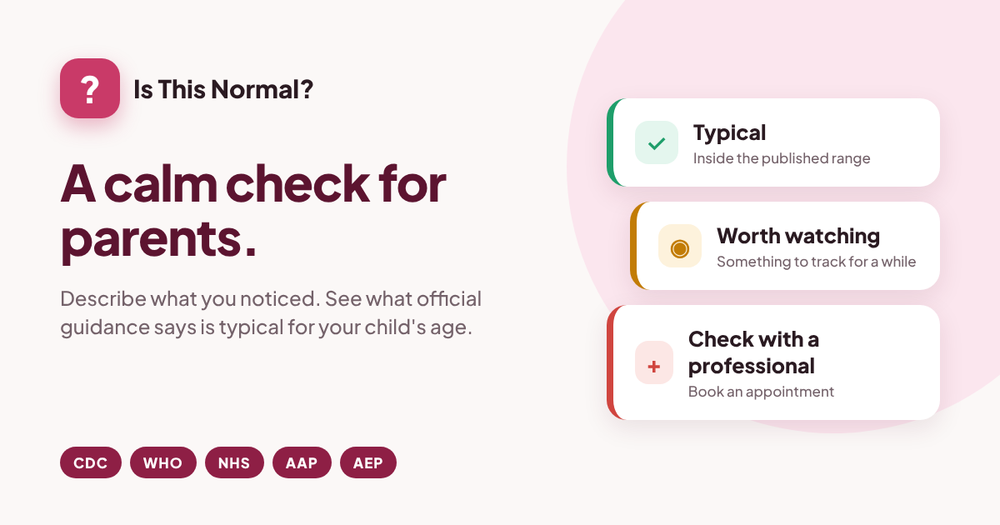

# Is This Normal?

**A calm check for parents.** Describe something you have noticed about your child, and see what official child health bodies say is typical for that age, what to try at home, and when it is worth asking a professional.

**Live:** https://is-this-normal-check.vercel.app



Part of my [daily AI builds](https://github.com/kakkarprerna/daily-ai-builds) series.

---

## The problem

Every parent has a 2am question. He's 14 months and not walking. She has eight words and her cousin has fifty. He used to say "more juice" and now he points.

The answers are out there, but scattered across the CDC, WHO, NHS, AAP and national paediatric bodies, each with its own way of describing age ranges. Search results swing between "totally normal, relax" and the worst case. Parents in multilingual homes get an extra layer of confusion, because most milestone charts quietly assume one language.

What a parent actually needs is simpler: where does this sit against the published guidance, and do I need to book an appointment?

## What it does

You give it four things: your child's age, the area (movement, speech, sleep, behaviour and so on), what you noticed in your own words, and a little context such as how long it has been going on and whether anything changed recently.

It returns:

| | |
|---|---|
| **A verdict** | Typical, Worth watching, or Check with a professional, with a confidence level |
| **The typical range** | What the guidance says about this skill at this age, in one line |
| **What the bodies say** | Each source named, with what it says paraphrased |
| **Why** | Reasoning tied to the specifics you gave, not generic advice |
| **Try at home** | Practical things to do this week |
| **Watch for** | Signs that would change the picture |
| **Book an appointment if** | Clear triggers to stop watching and ask |
| **Who to ask** | Named services for Spain, the UK and the US |
| **Questions to bring** | So the appointment is useful |
| **Limits** | What a text check cannot tell you |

## Design decisions

**It never diagnoses.** The model is told never to name a condition, likely or possible. The output describes position against published ranges and points to the right professional. That keeps the tool honest about what text can and cannot do, and keeps it clear of medical device territory.

**Safety rules do not depend on the model.** Two rules run deterministically in the browser:

- **Lost skills always mean "check".** If a parent ticks "they used to do this and have stopped", the verdict is forced to *Check with a professional* whatever the model returns, and the result says so. Every body cited treats loss of skills as a reason to see someone, at any age.
- **Emergency words trigger an urgent banner** before anything is sent: seizures, breathing trouble, a child who is hard to wake, swallowed substances. It shows the emergency number for the chosen country.

**Multilingual homes are counted properly.** Words are counted across every language at home, following ASHA and AEP guidance that bilingualism does not cause delay. I built this for expat families like mine, where a child might hear three languages in a day.

**Sources are named or not used.** The model may only draw on CDC, WHO, NHS, AAP, AEP and ASHA guidance, and has to name the body behind every claim. If it is unsure of a figure, it is told to describe it in general terms rather than invent one.

**"Who to ask" is fixed, not generated.** The contacts for Spain (pediatra, enfermera de pediatría, atención temprana), the UK (health visitor, GP, school nurse) and the US (pediatrician, Early Intervention) are written into the app so they are always right.

**Nothing is stored.** No sign-in, no database, no analytics on what is typed.

## Try it without a key

Open **Examples** for three saved checks, one of each verdict:

1. **Few words in a three-language home.** 20 months, around eight words across Spanish, English and Hindi. *Worth watching.*
2. **Not walking at 14 months.** Crawls, pulls up and cruises, no steps alone yet. *Typical.*
3. **Stopped using words he had.** 2 and a half, had two-word phrases, now mostly points. *Check with a professional*, set by the lost-skills rule.

## Models

By default the app runs **Meta Muse Glimmer 30B** on NVIDIA's free OpenAI-compatible endpoint, using a key held server-side. Visitors can switch to **Anthropic, OpenAI or Gemini** with their own key. A visitor's key is sent once with that request and is never stored or logged.

The model replies in tagged lines (`VERDICT:`, `SAYS:`, `TRY:` and so on) rather than JSON. Smaller models follow that format far more reliably, and it is what makes switching providers cheap.

## Run it locally

```bash
npm install
npm run dev
```

To use the default model locally, run with `vercel dev` and set these environment variables:

| Variable | Example |
|---|---|
| `LLM_BASE_URL` | `https://integrate.api.nvidia.com/v1` |
| `LLM_MODEL` | the Muse Glimmer model id from your NVIDIA build page |
| `LLM_API_KEY` | your NVIDIA API key |

The examples and bring-your-own-key options work without them.

## How it is built

```
is-this-normal/
├── api/check.js        Serverless function: system prompt, provider routing, input checks
├── src/App.jsx         Interface: sidebar, form, results, examples, sources
├── src/rules.js        Deterministic layer: urgent scan, lost-skills override, who to ask, parser
├── src/examples.js     Three worked examples with saved results
├── src/styles.css      Rose palette, rounded cards, fixed sidebar
└── public/og-image.png Link preview
```

React and Vite, deployed on Vercel. The system prompt and default key live in the serverless function, never in the browser bundle.

## Sources

- [CDC, Learn the Signs. Act Early.](https://www.cdc.gov/act-early/) (2022 milestones)
- [WHO Child Growth Standards and motor development study](https://www.who.int/tools/child-growth-standards)
- [NHS, Baby and toddler development](https://www.nhs.uk/conditions/baby/babys-development/)
- [AAP, HealthyChildren.org](https://www.healthychildren.org/)
- [AEP, En Familia](https://enfamilia.aeped.es/)
- [ASHA, Learning more than one language](https://www.asha.org/public/speech/development/learning-two-languages/)

## Limits

This is an information tool, not medical advice. It cannot see or hear your child, cannot assess hearing or muscle tone, and works only from what you type. Age ranges are guides, and children develop at their own pace. If you are worried, your paediatrician or health visitor is always the right call. In an emergency, call 112 (Spain), 999 (UK) or 911 (US).

---

Built by [Prerna Kakkar](https://github.com/kakkarprerna), Senior Product Manager.
