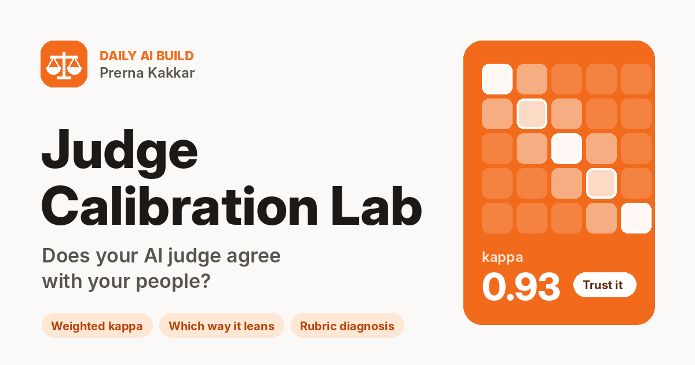

# Judge Calibration Lab

**Does your AI judge agree with your people?**

Live: [judge-calibration-lab.vercel.app](https://judge-calibration-lab.vercel.app)



Most teams that ship an AI feature end up grading it with another AI model. The judge scores thousands of responses, the scores go on a dashboard, and launch decisions get made from that dashboard. Very few teams check whether the judge actually scores the way their own people would.

Judge Calibration Lab runs that check. You give it a rubric and a small golden set of items your people have already scored by hand. It has a model score the same items, then shows how closely the two agree, which way the judge leans, and which rubric wording is behind each disagreement.

Part of my [daily AI builds](https://github.com/kakkarprerna/daily-ai-builds) series.

---

## The problem it solves

A judge that agrees with people 70% of the time sounds fine. It isn't fine if every miss goes the same way. In the telco example below, the judge scores six answers higher than people did and none lower, and two of those six are answers that invent a cancellation or pause policy. A dashboard built on that judge would show a support bot getting better while customers get told things that are not true.

More often than not the root cause sits in the rubric. Phrases like "matches published policy" or "the caller had to repeat themselves" read clearly to the people who wrote them and mean something different to a model that lacks their context. This tool is built to find those phrases.

## What you get

| | |
|---|---|
| **Verdict** | Trust it with spot checks, usable after rubric fixes, or recalibrate before you rely on it |
| **Weighted kappa** | Agreement after removing chance, with big misses counting more than near misses |
| **Exact and close match** | How often the judge gives the same score, or one within a point |
| **Lean** | Whether the judge is stricter or more lenient than your people, overall and at each score level |
| **Score heatmap** | Human score against judge score, so clusters off the diagonal stand out |
| **Disagreement list** | Every miss, biggest first, with the judge's reason next to the human note |
| **Rubric diagnosis** | The wording the judge reads differently, suggested rewrites, items to add to the golden set, and human labels worth a second look |

## How it works

1. **Write the rubric.** Pick what is being judged and the scale (1 to 3, 1 to 4, 1 to 5, or your own), then describe each level.
2. **Paste the golden set.** Straight from a spreadsheet: `id, input, response, human, note`. If you already have judge scores, add `judge` and `judge_reason` columns.
3. **Run the judge**, or use the judge scores already in your data. The numbers appear straight away.
4. **Diagnose the rubric.** The disagreeing items, a few agreeing ones for contrast, and the statistics go to the model, which points to the wording behind the misses.

The statistics and the verdict are worked out in the browser with fixed formulas. Only the judge scores and the diagnosis come from a model.

## Verdict rules

| Verdict | Rule |
|---|---|
| Too few items to tell | Fewer than 8 items with both a human and a judge score |
| Trust it, with spot checks | Kappa ≥ 0.80, close match ≥ 90%, average lean within ±0.30 |
| Usable after rubric fixes | Kappa ≥ 0.60, close match ≥ 80% |
| Recalibrate before you rely on it | Anything below that |

Kappa is quadratic weighted kappa (Cohen, 1968). Close match means within one point on scales with four or more levels, and exact match on shorter scales. The cut-offs follow the common reading of 0.6 as substantial and 0.8 as near-complete agreement; a launch gate may want stricter ones. All of this is printed in the app under **Method**.

## Three worked examples

Each loads with saved judge scores and a saved diagnosis, so the app works without an API key. The items are invented for this demo to show patterns I have seen in real evaluation work.

| Example | What happens | Verdict |
|---|---|---|
| **Telco support bot, policy accuracy** | The judge rewards confident, actionable answers even when they invent a policy, because it never saw the policy | Recalibrate (kappa 0.49, lean +1.0) |
| **Meeting summaries, faithfulness** | Close agreement; the judge is slightly stricter on blurred numbers and dates | Trust with spot checks (kappa 0.93) |
| **Voice agent calls, resolution** | The judge reads line noise as agent failure, ignores warm handovers, and applies a rule the rubric never states | Usable after fixes (kappa 0.75, lean −0.5) |

The voice agent case comes from my time at Jinn Live, where background noise and holds on real calls broke flows that worked fine in demos. Deciding whose fault a repeat is turned out to matter as much for scoring as it did for the product.

## Model providers

| Provider | Key |
|---|---|
| **Muse Glimmer** (default) | Free to try on the site owner's key via NVIDIA's endpoint. Visitors can paste their own NVIDIA key instead |
| **Anthropic** | Bring your own key |
| **OpenAI** | Bring your own key |
| **Gemini** | Bring your own key |

The judge runs at temperature 0. Model output comes back as tagged lines rather than JSON (`ITEM|id|score|reason`), which keeps the parser simple and makes swapping providers cheap.

## Privacy

- No sign-in, no database, nothing stored. Closing the tab clears everything.
- Text leaves the browser only when you press **Run the judge** or **Diagnose the rubric**, and only to the provider you picked.
- A pasted key travels with that one request and is never saved or logged.
- Prompts and the site owner's key live in a serverless function, not in the browser bundle.

## Limits

- Ten items gives a rough read. Twenty to fifty, with deliberately hard cases, gives one you can defend.
- If almost every human score sits at one level, kappa can come out low even when the judge mostly agrees. Check the heatmap before reading too much into it.
- Human labels can be wrong. Where two people disagree with each other, settle that first.
- The diagnosis is a model reading your rubric. Treat its rewrites as candidates, then re-run the judge to see whether they close the gap.

## Run it locally

```bash
npm install
npm run dev          # the interface only; the examples work without the API
npx vercel dev       # interface plus the /api/judge function
```

Copy `.env.example` to `.env.local` and set `LLM_BASE_URL`, `LLM_MODEL` and `LLM_API_KEY` for Muse Glimmer. Model names for the other providers can be overridden with `ANTHROPIC_MODEL`, `OPENAI_MODEL` and `GEMINI_MODEL`.

## Project layout

```
judge-calibration-lab/
├── api/judge.js        serverless function: prompts, provider routing, size limits
├── src/lib.js          CSV parsing, tagged-line parsing, kappa and verdict rules
├── src/examples.js     the three worked examples with saved results
├── src/App.jsx         interface: Start here, Calibrate, Examples, Method
├── src/styles.css
├── public/og-image.png link preview
└── vercel.json         rebuilds only when this folder changes
```

## Built with

React and Vite, deployed on Vercel. I designed and directed the build with AI coding tools: product scope, rubric logic, verdict rules, worked examples and interface decisions are mine.

---

Prerna Kakkar · Senior Product Manager · [GitHub](https://github.com/kakkarprerna)
