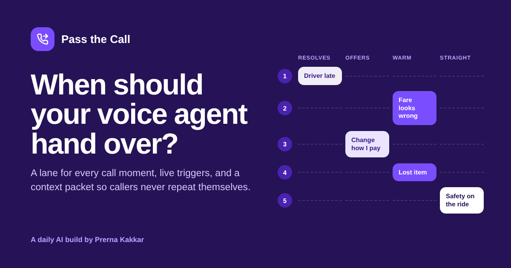

# Pass the Call

**Plan when an AI voice agent should hand a call to a person, and what that person sees when they pick up.**

[Live app](https://pass-the-call.vercel.app) · Three worked examples run without a key



---

## The problem

Most voice agent launches get the handover wrong in one of two directions. Either the agent holds on to callers who plainly want a person, or it passes so many calls that the queue looks the same as before launch. Both usually come from one blanket rule ("transfer if the caller asks", "transfer after three failures") applied to every reason someone rings.

A late driver and a safety incident on a ride are not the same call. Neither are a balance check and a customer who says they cannot pay. And when the call does reach a person, the most common complaint is having to repeat everything the agent already asked.

A product manager needs to set the handover per reason for calling, cover what happens mid-call whatever the reason, and decide what travels with the call. Then explain all of it to engineering and the contact centre lead in the same terms.

## What it does

You describe the phone line: who calls, what they ring about, what the agent can do with its systems and what only the team can do. You add the human cover, how calls reach a person, the languages involved and any constraints. A model splits the line into call moments and suggests five facts about each. Fixed rules then place every moment in one of four lanes:

| Lane | What happens |
| --- | --- |
| **Agent resolves** | The agent finishes the call. A person is one ask away |
| **Agent resolves, offers a person** | The agent finishes, then offers a person before ending. A first request is honoured straight away |
| **Agent gathers, warm transfer** | The agent verifies, captures the facts a person needs, then passes the call with a context packet |
| **Straight to a person** | One line of capture, then a person. No checks, no attempts to solve |

You then get:

| | |
| --- | --- |
| **The handoff map** | Every call moment on a lane board with the reason it landed there. Change any fact and watch it move |
| **Live triggers** | Rules for what happens mid-call in any moment: asking for a person, failed turns, loops, distress, noise, silence, unsupported languages and card details |
| **Out-of-hours plan** | What each lane turns into when nobody is in, with a warning for moments that have nowhere to go at night |
| **What the person sees** | A screen-pop preview of the context packet for each transferred moment, with the rule that the person never asks again |
| **Handover lines** | What the agent says when it passes the call, drafted per moment |
| **Metrics to watch** | Six numbers that show whether the handover works once live, with no invented targets |
| **A handoff spec** | The whole plan as Markdown, to copy or download into a ticket or brief |

## The design choice that matters

**The model describes. Rules decide.** When a caller gets a person should not change with the wording of a prompt or the mood of a model on a given run. So the model only splits the line into moments and suggests facts from fixed word lists. Lanes, hard rules, live triggers, out-of-hours outcomes and the share of calls reaching a person are all worked out in the browser with printed rules. The same facts always give the same plan, and anyone can see which fact to argue about.

This is the same split as Who Does What?, Worth Building? and Judge Calibration Lab in this repo.

## How the lanes work

Each call moment gets points for five facts:

| Fact | Options and points |
| --- | --- |
| What a mistake touches | Information only 0 · A booking or record 1 · Money 2 · Safety or wellbeing 3 |
| How callers sound | Calm 0 · Frustrated 1 · Upset or anxious 2 |
| Identity check | None 0 · Light 1 · Strong 2 |
| Can the agent finish it | Fully 0 · Partly 2 · No 4 |
| How callers explain it | Short and predictable 0 · Varied 1 · Long story 2 |

Points map to a lane: 0 to 2 resolves, 3 to 5 offers a person, 6 to 9 warm transfer, 10 or more straight over. Then four hard rules, which only ever bring a person in sooner:

- **R1** Safety or wellbeing at stake: straight to a person.
- **R2** The agent cannot finish it: warm transfer at least, straight over if callers are upset.
- **R3** Money behind a strong identity check that the agent cannot complete alone: warm transfer at least.
- **R4** Regulated line, upset caller, agent cannot fully finish: warm transfer at least.

How often a moment comes up (common, occasional, rare) carries no points. It only weights the rough share of calls that reach a person, which the app labels as a weighting and not a forecast.

## The live triggers

| | Trigger | Rule |
| --- | --- | --- |
| T1 | Caller asks for a person | Second request, or first in any moment beyond "Agent resolves". First request always if vulnerable callers are likely |
| T2 | Agent cannot understand | Two failed turns in a row |
| T3 | Going in circles | The same question or answer three times |
| T4 | Distress or vulnerability | At once, to the priority queue, skipping checks |
| T5 | Noise guard | Background noise or hold music during the opening message never counts as an interruption or a failed turn |
| T6 | Long silence | Re-prompt twice, then offer a callback. Silent calls never join the queue |
| T7 | Language the agent does not speak | Switched on for any caller language the agent lacks |
| T8 | Card details on the call | Switched on by the card payments constraint. Card numbers move to secure capture and never enter the transcript or packet |

T5 comes from a real deployment, where road noise and hold music during the agent's opening message were read as interruptions and broke calls that were going fine.

## Worked examples

| Example | Shape |
| --- | --- |
| **Rider support line** (ride-hailing) | Staffed 24/7, three caller languages and two agent languages, card payments. Shows R2 moving an invoice request the agent cannot issue into a warm transfer |
| **Car service bookings** (automotive) | Business hours only, five regional languages. Routine bookings stay with the agent, and the out-of-hours plan flags that the breakdown moment has nowhere to go at night |
| **Card and account line** (banking) | Regulated, 24/7, vulnerable callers likely. Card blocks stay with the agent, unknown payments get a warm transfer, financial difficulty goes straight over |

Each loads a saved model breakdown and runs through the same rules as a live plan.

## Where the method comes from

The facts, points and lanes are my own working method from deploying voice agents for enterprise clients, including multilingual lines handling thousands of calls a day. They are not an industry standard. The "never ask again" packet follows common contact centre practice for warm transfers. Moments, early signals, fields to capture, handover lines and open questions are the model's suggestions and should be checked with the people who take the calls.

## What it does not do

- It does not check legal duties, such as rules on vulnerable customers or telling callers they are speaking to an AI.
- It does not size the human queue. A plan that passes 40% of calls needs the people to take them.
- The share of calls reaching a person is a weighting from three frequency words. Replace it with real call data once you have it.
- Call reasons the description leaves out are invisible to it. Listen to real calls before trusting the map.

## Model and privacy

The breakdown runs on **Muse Glimmer** through NVIDIA's free endpoint by default, on the site's own key. Visitors can switch to Anthropic, OpenAI or Gemini with their own key, which is sent with that one request and never stored. The prompt and the site key live in a serverless function, not in the browser bundle. Output comes back as tagged lines rather than JSON, which keeps the provider swap cheap.

## Run it locally

```bash
npm install
npx vercel dev
```

Set these environment variables for the default model:

```
LLM_BASE_URL=https://integrate.api.nvidia.com/v1
LLM_MODEL=<Muse Glimmer model id>
LLM_API_KEY=<your NVIDIA key>
```

Without them, the worked examples still run, and visitors can bring their own key.

## Stack

React and Vite, deployed on Vercel. One serverless function (`api/plan.js`). Lane rules, triggers and the spec export live in `src/handoff.js`. Icons from Lucide.

---

Part of [Daily AI Builds](../) by Prerna Kakkar.
