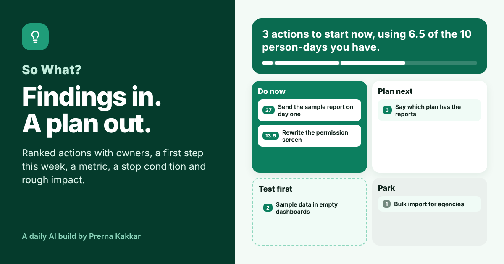

# So What?

**Paste research, feedback or a metric readout. Get the insights that matter for your goal, actions ranked against the capacity you actually have, an owner, a metric and a stop condition for each, rough money or hours ranges, and the first steps for this week.**

[Live app](https://so-what-plan.vercel.app) · Three worked examples run without a key



---

## The problem

Most teams are not short of findings. They have interview notes, a support tag report, a survey export and a dashboard someone screenshotted in a meeting. What they are short of is the step after: which of these do we act on, who does it, how big is it, and what happens on Monday.

That step tends to go wrong in two ways. The most vivid quote becomes the roadmap, even when it came from one person. Or every finding gets an action, the list is longer than the team, and nothing ships. Both are judgement calls that get made quickly and quietly, so nobody can see why one thing went first.

So What? makes those calls visible. Every insight shows the quote it rests on and whether that quote is really in your material. Every action shows how its score was worked out. A capacity you set decides what fits in Do now, and anything that does not fit says so.

## What it does

You paste the material, say what the team is trying to move and how it is measured, and pick how many person-days you can give it. Baselines for revenue and team hours are optional.

| | |
| --- | --- |
| **What we learned** | 3 to 7 insights, each with a so what against your goal, a strength (single mention, repeated, measured), a reach (few, some, most) and a quote checked word for word against your material |
| **Action plan** | Every action in one of four buckets: Do now, Plan next, Test first or Park. Each has an owner, an effort, a lever, a score and the rule that put it there |
| **Capacity** | Do now is filled in score order until your person-days run out. A strong action that does not fit says how many days it needs and how many are left |
| **Impact** | With a revenue baseline, a monthly range per action. With team hours, hours back per week. Both with an evidence-weighted figure |
| **First step, metric, stop if** | For every action: something to put in a calendar this week, the number that should move, and the result that means dropping it |
| **This week** | The first steps from Do now as a checklist, with owners |
| **Change the call** | Disagree with an effort, a goal fit, a strength or a reach? Click a different chip and the whole plan reorders |
| **Action brief** | The plan as Markdown, to copy into Notion, Linear, Jira or a message |

## The design choice that matters

**A model reads. Rules decide.** Asked "what should we do first?", a model will usually rank by how persuasive the text sounds. So the model here only reads the material and proposes: insights and actions, with every judgement picked from a fixed word list and a quote for every insight. Ranking, capacity, buckets and every number are worked out in the browser with printed rules.

The rules also check the model. Each quote is searched for in your material, ignoring case, spacing and quote marks. If it is not there, that insight drops one evidence level, and everything built on it scores lower. In the first worked example, one quote is a paraphrase rather than a copy, and the dashboard action built on it moves from Plan next to Test first.

This is the same split as Wrong Turn, Who Says Yes? and Who Does What? in this repo.

## How the plan is built

| Rule | What it does |
| --- | --- |
| **E1** | Every insight's quote is searched for in your material |
| **E2** | A quote that is not found drops the insight one evidence level, never below Single mention |
| **E3** | An action takes the strongest evidence and widest reach of the insights it is built on |
| **S1** | Score = reach (1 to 3) × evidence (1 to 3) × goal fit (1 to 3) ÷ effort (Hours 1, Days 2, Weeks 3, Months 4) |
| **P1** | Off goal goes to Park, whatever its score |
| **P2** | Single mention evidence goes to Test first when the action takes weeks or more, or reaches some or most users |
| **P3** | Score 6 or more is a Do now candidate, filled in score order until the person-days run out. The rest go to Plan next |
| **P4** | Score from 2 to under 6 goes to Plan next |
| **P5** | Anything below 2 goes to Park |
| **G1** | Revenue range = monthly revenue × lever range × reach share (few 20%, some 50%, most 100%). Weighted = midpoint × evidence weight (40%, 70%, 100%) |
| **G2** | Efficiency actions show hours back per week: team hours × lever range × reach share |

Effort counts against capacity as half a day (Hours), 3 (Days), 10 (Weeks) or 30 (Months) person-days.

## Where the numbers come from

Money and hours only appear when you enter your own baselines. The lever ranges (for example 1 to 4% of monthly revenue for a conversion action that reaches everyone) are **starting assumptions I set for illustration, not industry benchmarks**. They are editable on the plan page, and the right values are your own past results. Ranges are added up straight, which overstates the total when two actions move the same customers. The app says this next to every figure.

## The three worked examples

| Example | Material | What it shows |
| --- | --- | --- |
| **Trials that never get going** (B2B analytics SaaS) | A cohort review, nine interviews, a sales note and a ticket count | All four buckets, and the evidence check catching a paraphrased quote |
| **Too many chats reach a person** (conversational AI support) | A review of 200 chatbot handoffs and agent comments | Hours back per week instead of money, and a popular idea parked as off goal |
| **An update that cost customers** (HR tech, shift scheduling) | An NPS survey, product data and exit notes | A small team with five person-days, where a strong action waits because it does not fit |

Companies, people and numbers in the examples are invented.

## Model and keys

The default model is Meta's Muse Glimmer 30B on NVIDIA's free endpoint, running on this site's key, held in a serverless function and never sent to the browser. Visitors can switch to Anthropic, OpenAI or Gemini with their own key, which is sent once with the request and never stored. The prompt also lives in the function. Output comes back as tagged lines rather than JSON, which keeps the provider swap cheap.

## Run it locally

```bash
npm install
npx vercel dev
```

Set these environment variables for the default model:

```
LLM_BASE_URL=https://integrate.api.nvidia.com/v1
LLM_MODEL=<Muse Glimmer model id>
LLM_API_KEY=<your NVIDIA key>
```

Without them, the worked examples still run, and visitors can bring their own key.

## Stack

React and Vite, deployed on Vercel. One serverless function (`api/plan.js`). The evidence check, scoring, buckets, capacity fill, impact ranges and the brief export live in `src/plan.js`. Icons from Lucide.

---

Part of [Daily AI Builds](../) by Prerna Kakkar.
