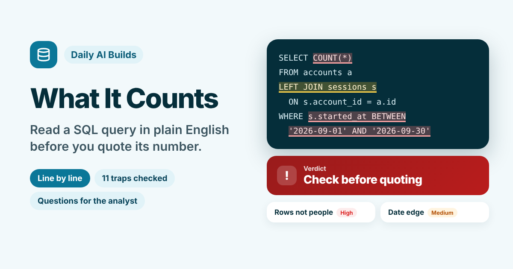

# What It Counts

**Paste the SQL behind a metric someone sent you. Get it in plain English, line by line, the traps that could skew the number, a verdict for how you plan to use it, and the questions to ask the person who wrote it.**

[Live app](https://what-it-counts.vercel.app) · Three worked examples run without a key



---

## The problem

A product manager gets a number in Slack: 1,240 active customers in September, a 74% containment rate, €2.1m from the new plan. Behind it is a query they did not write and may not be able to read. The number goes into a weekly update, a go or no-go call or a board slide.

Most metric mistakes I have seen were not bad maths. A join repeated every order once per line item. An OR without brackets let trial accounts skip the date filter. A share came out as 0 because two whole numbers were divided. None of these is hard to spot once someone points at the line, and the analyst who wrote the query can usually answer the question in a minute. The trouble is that nobody asks, because the person quoting the number cannot tell which question to ask.

What It Counts sits between the query and the slide. It says what the query does in business words, marks each trap on the exact line, and writes the message to the analyst.

## What it does

You paste the query, say which database runs it, what question the number should answer and where you will use it.

| | |
| --- | --- |
| **Pattern checks, live** | Twelve checks read the query in your browser as you type, with no model and no key |
| **Plain English** | One sentence on what number the query returns, what one row stands for before and after counting, and whether it answers your question |
| **Line by line** | Each step in the order the database applies it, with the exact line marked on the query |
| **Traps** | Eleven known traps, from double counting to whole-number division, each tied to the line that causes it, with a quick check to run and a question to ask |
| **Verdict** | Check before quoting, Quote with a caveat, No known traps, or Answers a different question. Stricter when the number is for a decision or a board deck |
| **Ask the analyst** | A ready-to-send message that quotes each risky line and asks about meaning, not syntax |
| **Caveat line** | One sentence to put under a chart if the number has to go out before you hear back |
| **Report** | The verdict, the query, every line explained and every trap with its check, as Markdown |

## The design choice that matters

**A model explains. Rules decide.** Whether a number is safe to quote should not depend on how sure a model sounds. So the known traps are found by pattern checks you can read, and the model only explains the query and points at lines. It picks each trap from a fixed list of eleven and has to quote the line it means. That line is searched for in the query. If it is not there, the trap does not count. Severity and the verdict come from printed rules.

When a pattern check and the model find the same trap, the card says they agree. In the revenue example, the pattern check D1 only knows that a SUM comes after a JOIN, so it flags possible double counting at Medium. The model sees that `order_total` belongs to the order while the join makes one row per item, so the two together raise it to High.

This is the same split as Wrong Turn, Frontline Pulse and Who Says Yes? in this repo.

## The rules

| Rule | What it does |
| --- | --- |
| **D1** | A SUM, COUNT or AVG after a JOIN is possible double counting (Medium). High if the model also finds repeated rows |
| **D2** | A LEFT JOIN whose table is then filtered in WHERE, other than with IS NULL, quietly drops rows with no match (High) |
| **D3** | NOT IN with a sub-query keeps nothing if the sub-query returns one empty value (High) |
| **D4** | `= NULL` or `<> NULL` is never true (High) |
| **D5** | BETWEEN or `<=` ending on a plain date loses the rest of the last day if the column holds times (Medium) |
| **D6** | COUNT(\*) with no COUNT(DISTINCT when the question asks about customers, users, accounts or similar (High) |
| **D7** | AVG of a rate, share or percentage, or of a division (Medium) |
| **D8** | LIMIT or TOP with no ORDER BY (Low) |
| **D9** | IN or NOT IN with three or more typed values, or a filter on a test, demo or internal label (Medium) |
| **D10** | COUNT divided by COUNT with no decimal cast in PostgreSQL, SQL Server or an unknown database (High) |
| **D11** | DATE(), `::date` or DATE_TRUNC with no time zone conversion (Low) |
| **D12** | AND and OR mixed in one WHERE without brackets (Medium) |
| **M1** | Every line the model quotes is searched for in the query, ignoring case and spacing. A trap whose line is missing does not count |
| **M2** | A trap found by a pattern check and the model is marked as agreed, at the higher severity |
| **V1** | The model says the query does not answer the question: Answers a different question |
| **V2** | Any High trap: Check before quoting |
| **V3** | Any Medium trap, or only a partial answer to the question: Quote with a caveat. For a decision or a board deck: Check before quoting |
| **V4** | Only Low traps or none: No known traps in the text |

Pattern checks blank out comments and the inside of quoted values before they run, so a comment that mentions a JOIN does not trigger D1.

## What it cannot see

It reads the query text only. It never runs the query and never sees your tables, so it cannot know whether a join is one to one. That is why D1 says possible. The pattern checks cover common traps, not every way a query can be wrong, and a clean result means no known trap was found in the text, not that the number is right. Whole-number division depends on the database, so the database choice matters. The model's explanations can be wrong too. Its quoted lines are checked, but what a line means is still worth confirming with the person who wrote it, and the app says so next to the message.

## The three worked examples

| Example | Query | What it shows |
| --- | --- | --- |
| **Active customers in September** (analytics SaaS, weekly metrics, PostgreSQL) | Accounts joined to sessions, counted | Counting sessions instead of customers, trial accounts slipping past the filters through an OR, and the last day of the month cut off |
| **Revenue by plan after the price change** (subscription SaaS, board deck, BigQuery) | Orders joined to line items and plans, summed | Order totals added once per item, a LIMIT that hides plans, four unexplained customer IDs, and the stricter board-deck verdict |
| **Containment rate for a voice agent** (conversational AI, a decision, PostgreSQL) | A daily share, then averaged | A share that comes out as 0, an average of daily rates, a NOT IN that can lose every call, and days cut in UTC |

Companies, people, tables and numbers in the examples are invented.

## Model and keys

The default model is Meta's Muse Glimmer 30B on NVIDIA's free endpoint, running on this site's key, held in a serverless function and never sent to the browser. Visitors can switch to Anthropic, OpenAI or Gemini with their own key, which is sent once with the request and never stored. The prompt also lives in the function. Output comes back as tagged lines rather than JSON, which keeps the provider swap cheap. The pattern checks need no model at all.

## Run it locally

```bash
npm install
npx vercel dev
```

Set these environment variables for the default model:

```
LLM_BASE_URL=https://integrate.api.nvidia.com/v1
LLM_MODEL=<Muse Glimmer model id>
LLM_API_KEY=<your NVIDIA key>
```

Without them, the pattern checks and the worked examples still run, and visitors can bring their own key.

## Stack

React and Vite, deployed on Vercel. One serverless function (`api/explain.js`). The pattern checks, line check, severity, verdict, analyst message, caveat line and report export live in `src/counts.js`. Icons from Lucide.

---

Part of [Daily AI Builds](../) by Prerna Kakkar.
