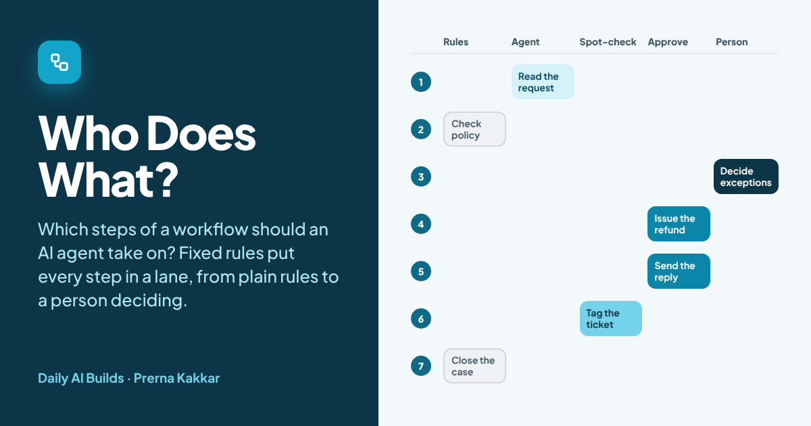

# Who Does What?

**Describe a workflow the way it happens today and see which steps an AI agent should run, which need a person to approve, and which a plain rule does better.**

[Live app](https://who-does-what.vercel.app) · Three worked examples run without a key



---

## The problem

"Let's put an agent on it" usually arrives as one decision for a whole workflow. In practice a refund flow or an invoice process is six or seven different jobs. Reading an email is low risk. Paying money back to a card is not. Checking a date against a policy needs no model at all.

When a team treats the whole thing as one job, two things go wrong. Either the agent gets more freedom than the riskiest step can bear, or every step gets an approval screen and the agent saves nobody any time. A product manager needs to split the work, judge each step on its own, and explain the call to engineering, operations and legal in the same terms.

## What it does

You describe the work, what starts it, who does it today and the systems involved. A model breaks it into steps and suggests five facts about each one. Fixed rules then place every step in one of five lanes:

| Lane | Who does the step |
| --- | --- |
| **Rules, no model** | A script or workflow tool. A model adds cost and risk here without adding anything |
| **Agent runs it** | The agent acts alone, with every action logged |
| **Agent runs it, sample checked** | The agent acts alone and a person reviews a regular sample |
| **Agent drafts, person approves** | Nothing leaves the step until a person signs it off. On a live call, a warm transfer |
| **Person decides, agent prepares** | A person makes the call with the facts gathered for them |

You then get:

| | |
| --- | --- |
| **The map** | Every step on a lane board, in order, with the reason it landed there |
| **An editable breakdown** | Change any fact on any step and watch it move lanes. Add your own value where the options don't fit |
| **Approval points** | Back-to-back approval steps grouped into one screen, so the approver sees the whole action |
| **Tool access** | Each system the agent touches, read only or read and write |
| **Failure modes** | How each risky step fails in practice, the signal a team would notice and a guard |
| **A rollout plan** | Shadow mode, then go live with oversight, then earn more autonomy, with a condition to move on at each phase |
| **Questions for the process owner** | What the description leaves unclear that would change a fact |
| **An agent brief** | The whole map as Markdown, to copy or download into a ticket or spec |

## The design choice that matters

**The model describes. Rules decide.** How much freedom an agent gets should not depend on the wording of a prompt or the mood of a model on a given run. So the model only splits the steps and suggests facts from a fixed list of words. Points, lanes, overrides, approval points and the rollout are all worked out in the browser with printed rules. The same facts always give the same answer, and anyone can see which fact to argue about.

This is the same split as Worth Building?, Judge Calibration Lab and Pulse Check in this repo.

## How the lanes work

Each step gets points for five facts:

| Fact | Options and points |
| --- | --- |
| What the step does | Read or look up 0 · Compare or calculate 0 · Sort or judge 1 · Draft text 1 · Update a record 2 · Send outside 2 · Move money 3 |
| Judgement needed | None 0 · Some 1 · High 3 |
| What it works from | Structured fields 0 · Mixed 1 · Free text or voice 1 |
| If it goes wrong | Easy to undo 0 · Hard to undo 2 · Cannot undo 3 |
| Who it touches | Internal only 0 · Customer sees it 1 · Money or legal 2 · Regulated or personal data 3 |

Then, in order:

```
R0          no judgement + structured fields + no text to write  →  Rules, no model
0 to 2      points                                               →  Agent runs it
3 to 5      points                                               →  Agent runs it, sample checked
6 to 8      points                                               →  Agent drafts, person approves
9 or more   points                                               →  Person decides, agent prepares

Hard overrides, which can only add oversight:
R1          moves money                                                     →  at least approve each
R2          cannot undo + some or high judgement + reaches beyond the team  →  at least approve each
R3          high judgement on regulated or personal data                    →  person decides
```

A value you type in yourself has no weight of its own, so it scores as the middle of that fact's range and the step is marked as custom.

## Worked examples

| Example | What it shows |
| --- | --- |
| Refund requests for an online homeware shop | The policy check runs on a rule. Issuing the refund and sending the reply share one approval screen, and exceptions stay with a person |
| Supplier invoice matching in finance operations | Most of the work is matching and posting, which rules do better than a model. The agent earns its place on messy PDFs and explaining variances |
| Service appointment changes by voice for a car dealer group | A voice agent with a narrow job. Bookings move on rules behind it, the conversation is sample checked, and warranty or complaint calls go to a person |

Each example stores a saved model reply in the same format the live model returns, so it runs through the same parser and the same rules as a fresh map.

## Where the judgement comes from

- The facts, points and bands are my own working method from deploying voice agents and chatbots for enterprise clients. They are not an industry standard, and every point value is printed so you can disagree with it.
- The lanes follow common human-in-the-loop practice: approvals on irreversible and financial actions, least tool access, and a shadow phase before anything goes live.
- Failure modes, tool access and the open questions are the model's suggestions from your description. Treat them as a first draft for the people who do the work.

## What it leaves out

- It does not check legal duties. Human oversight rules apply to high-risk uses under the EU AI Act, and that needs your legal team.
- Points add up step by step, so it misses risk that only shows up when two steps fail together.
- It does not cost anything. Pair it with [Worth Building?](../worth-building) before you build.
- The map is only as good as the description. Exceptions nobody mentions are invisible to it.

## Built with

- React and Vite, deployed on Vercel
- A serverless function (`api/map.js`) holds the prompt and the key, so neither reaches the browser
- Meta Muse Glimmer on NVIDIA's free endpoint by default. Visitors can bring their own Anthropic, OpenAI or Gemini key, used for one request and never stored
- Tagged-line model output (`STEP|3|Issue the refund|...|Move money|None|Structured|Cannot|Money or legal`) instead of JSON. A broken line is skipped, and loose wording such as "irreversible" or "semi-structured" is matched to the fixed list

## Run it locally

```bash
cd who-does-what
npm install
npx vercel dev
```

Set these in `.env.local` or in Vercel:

| Variable | Value |
| --- | --- |
| `LLM_BASE_URL` | `https://integrate.api.nvidia.com/v1` |
| `LLM_MODEL` | The Muse Glimmer model id on NVIDIA |
| `LLM_API_KEY` | Your NVIDIA API key |

## Why I built it

Agentic platform roles keep asking the same question in interviews: where does the agent stop and the person start? At Jinn Live I answered it step by step for voice agents, deciding which parts of a call the agent could handle and where it had to hand over with context. This build turns that method into something a team can argue with: one fact at a time, with the rule that moved each step printed next to it.

Part of [Daily AI Builds](../README.md) by Prerna Kakkar.
