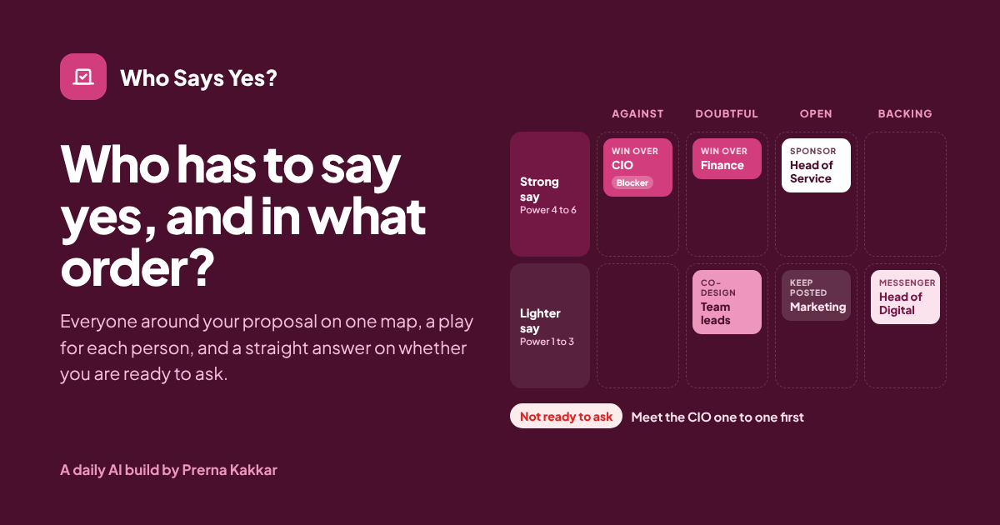

# Who Says Yes?

**Map everyone whose agreement a proposal needs, give each person a play, and get the order to meet them in and a straight answer on whether you are ready to ask.**

[Live app](https://who-says-yes.vercel.app) · Three worked examples run without a key



---

## The problem

Good proposals die in the room for reasons that have little to do with the idea. Someone who could block it hears about it for the first time in the decision meeting. The people who will live with the change find out after it is agreed and quietly resist it. A doubtful approver is pitched cold when a colleague they trust could have raised it first. Or the ask goes in while one sign-off is still against it, and a recorded no is much harder to reverse than a delay.

Most product managers carry the map of who matters in their head. That works until the proposal crosses teams, or until you are new, or until someone asks you to explain why you are meeting the CIO before the finance lead. The map, the reasoning and the order rarely get written down.

## What it does

You describe what you are proposing and what you know about the people around it, in plain words. You add the kind of ask, the timing, your position and any constraints. A model lists the 4 to 9 people or groups that matter and suggests five facts about each. Fixed rules then give every person one of five plays:

| Play | Who | What you do |
| --- | --- | --- |
| **Sponsor** | Strong say, already on side | Ask them to put their name to it. Meet them first |
| **Win over** | Strong say, not on side yet | A one to one before any group meeting, led by their worry |
| **Co-design** | Lives with it every day | Bring them in to shape the detail before it is decided |
| **Messenger** | On side, and someone listens to them | Ask them to vouch for it to the person they sway |
| **Keep posted** | Little say, little change | A short note at the key moments |

You then get:

| | |
| --- | --- |
| **The buy-in map** | Everyone on a say and stance grid, coloured by play. Click anyone to see why they landed there, then change a fact and watch the map, the order and the verdict move |
| **Likely worries** | What each person is most likely to push on, and the evidence or change that answers it |
| **The ask** | One specific thing to ask each person for, something they can say yes to in one meeting |
| **Who sways whom** | Who each person listens to, used to name introductions and to sequence messengers before the people they sway |
| **Order of approach** | Seven rounds, from lining up cover to telling everyone else, with the reason for each and fixed steps from your constraints |
| **Ready to ask?** | A verdict from the people who sign off or can block, the people who would move it, and the open questions |
| **A buy-in plan** | The whole thing as Markdown, to copy or download into a doc or a message to your sponsor |

## The design choice that matters

**The model describes. Rules decide.** Who you meet first, and whether you are ready to ask, should not change with the wording of a prompt. So the model only lists people and suggests facts from fixed word lists, plus draft worries, asks and links. Plays, warnings, order and verdict are all worked out in the browser with printed rules. The same facts always give the same plan, and anyone can see which fact to argue about.

This is the same split as Pass the Call, Who Does What? and Worth Building? in this repo.

## How the plays work

Each person gets five facts:

| Fact | Options and points |
| --- | --- |
| Part in the decision | Signs off 3 · Can block 3 · Shapes the detail 2 · Has to live with it 1 · Kept informed 0 |
| Weight in the room | High 3 · Medium 2 · Low 1 |
| Where they stand today | Backing +2 · Open +1 · Unknown 0 · Doubtful -1 · Against -2 |
| How much it changes their work | Heavy 2 · Some 1 · Little 0 |
| Your route to them | Direct · Through someone · None yet (no points, only triggers R3) |

Power is part in the decision plus weight in the room, out of 6. Four or more is a strong say. Plays are checked top to bottom: strong say and stance above zero is a Sponsor; strong say otherwise is Win over; heavy change to their work is Co-design; on side and swaying someone is Messenger; everyone else is Keep posted.

Five hard rules add warnings:

- **R1** Signs off or can block, and against. A blocker. The verdict cannot read Ready.
- **R2** Signs off, stance unknown. Find out before meeting anyone doubtful.
- **R3** Strong say, no route in. Names who can introduce you, if anyone on side sways them.
- **R4** Heavy change to their work and not on side. Involve them before the plan is fixed.
- **R5** Little formal say, high weight, not on side. Preview it with them first.

## The verdict

Only people who sign off or can block count.

| Verdict | When |
| --- | --- |
| **Not ready to ask** | Any blocker, or anyone who signs off is doubtful or against |
| **Getting there** | Anyone who decides is still unknown or doubtful |
| **Ready to ask** | Everyone who decides is open or backing it |

Two numbers sit beside it: weighted support (every stance weighted by power) and the share of decision power already on side. Both are summaries of your inputs, not a forecast of the vote.

## Worked examples

| Example | Shape |
| --- | --- |
| **Replace the phone menu with a voice agent** (contact centre) | The line owner is open, but the CIO is against it after last year. Not ready to ask: R1 on the CIO, R3 on a works council nobody has a route to, and three gates from security, privacy and employee representation |
| **Move from seats to usage-based pricing** (B2B SaaS) | The CEO backs it, sales and engineering see cost first, and the board has not been asked. Getting there: R3 names the CEO as the route to the lead investor |
| **One discovery process for three squads** (product team) | Both leaders who decide are on side. Ready to ask, but the real work is co-design with the engineering managers who will run it every week |

Each loads a saved people list and runs through the same rules as a live map.

## Where the method comes from

The two axes build on the power and interest grid taught in project management courses such as the PMP, and the stance scale follows the same idea as the stakeholder engagement assessment in the PMI's guidance. The plays, points, rules and order are my own working method from leading cross-functional work without formal authority at two startups, where getting sales, marketing and founders behind a roadmap meant sequencing the conversations as much as making the case. They are not an industry standard. People, worries, asks and links are the model's suggestions and should be checked against what you actually know.

## What it does not do

- It only knows what you type. Stances are your guesses, and the map is only as good as them.
- It does not write the pitch or the deck. It tells you who hears it, in what order, and what they will push on.
- People missing from your description are missing from the map. Ask your sponsor who else should be on it.
- The note on works councils is general background on EU practice, not legal advice.

## Model and privacy

The people list runs on **Muse Glimmer** through NVIDIA's free endpoint by default, on the site's own key. Visitors can switch to Anthropic, OpenAI or Gemini with their own key, which is sent with that one request and never stored. Nothing typed is saved, and roles work as well as names for sensitive proposals. The prompt and the site key live in a serverless function, not in the browser bundle. Output comes back as tagged lines rather than JSON, which keeps the provider swap cheap.

## Run it locally

```bash
npm install
npx vercel dev
```

Set these environment variables for the default model:

```
LLM_BASE_URL=https://integrate.api.nvidia.com/v1
LLM_MODEL=<Muse Glimmer model id>
LLM_API_KEY=<your NVIDIA key>
```

Without them, the worked examples still run, and visitors can bring their own key.

## Stack

React and Vite, deployed on Vercel. One serverless function (`api/map.js`). Plays, rules, the order and the plan export live in `src/buyin.js`. Icons from Lucide.

---

Part of [Daily AI Builds](../) by Prerna Kakkar.
