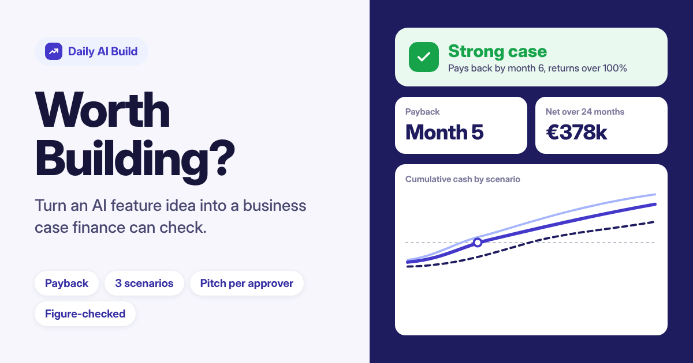

# Worth Building?

**Turn an AI feature idea into a business case you can take to the people who approve budget.**

[Live app](https://worth-building.vercel.app) · Three worked examples run without a key



---

## The problem

Most AI feature proposals arrive with a demo and a hopeful number. "It saves agents four minutes a ticket" becomes a headline saving, and nobody asks whether those minutes turn into money, what the model fees and human checks cost, or what one wrong answer costs. Finance then says no for reasons the team could have seen coming, or says yes to something that never pays back.

A product manager needs a way to test the case before the meeting, see which assumptions it rests on, and walk in with an answer for each person in the room.

## What it does

You describe the feature and enter your best numbers. Each number gets a tag for how sure you are: **measured**, **benchmark** or **guess**.

The app then gives you:

| | |
| --- | --- |
| **A verdict** | Strong, Workable, Weak or No case, from fixed bands |
| **The headline figures** | Payback month, net value over the horizon, return on money in, monthly net at full adoption |
| **Three scenarios** | Conservative, base and optimistic, plotted as cumulative cash |
| **What it rests on** | Every input moved 25% down and up, ranked by how much it shifts the result |
| **Check these first** | The inputs with the biggest swing that are still guesses or benchmarks |
| **A written case** | A summary, the problem, the ask, a pitch per approver with their likely objection and your answer, checks to run, risks, stop rules and a non-AI option |
| **A figure check** | Every euro amount, percentage and month in the written case is checked against the calculated sheet |

## The design choice that matters

**The model never produces a number.** All the maths runs in the browser with fixed, printed formulas. The model receives the finished figure sheet and writes the words around it. A check then scans the text and flags any figure that is not on the sheet, so a confident but invented saving cannot slip into a document finance will read.

This is the same split as Judge Calibration Lab and Pulse Check in this repo: rules where the answer has to be the same every time, a model where judgement and wording help.

## How the numbers work

Worked out for every month of the horizon:

```
progress      = min(1, month / months to reach peak)
tasks handled = tasks per month × peak adoption × progress
time value    = tasks handled × minutes saved / 60 × hourly cost × share of saved time put to use
other value   = (monthly cost avoided + monthly revenue × uplift) × progress
costs         = fixed running + AI fees + human review + errors
net           = time value + other value − costs
cumulative    = − build cost + net for each month so far
payback       = first month cumulative reaches zero
return        = net value / (build cost + all running costs)
```

**Verdict bands**, checked in order: No case if it still loses money each month at full adoption. Strong case if it pays back by month 6 and returns at least 100%. Workable case if it pays back inside the horizon. Weak case otherwise.

**Share of saved time put to use** is in there on purpose. Saved minutes only become money if they go somewhere: a backlog cleared, overtime cut, a hire not made. It is usually the most argued number in an AI business case, so the app makes you state it.

## Worked examples

| Example | Verdict | Why it is interesting |
| --- | --- | --- |
| Reply drafts for an energy retailer's support team | Workable, pays back in month 17 | The conservative scenario never pays back, so the case asks for a gated pilot first |
| Meeting notes for a 40-person sales team | No case | The running cost is higher than the time saved, even in the optimistic scenario |
| Invoice capture for finance operations | Strong, pays back in month 5 | Most of the value rests on cutting an outsourcing contract, so that is the number to confirm |

Each example loads its inputs and a saved written case, so the whole flow works without an API key.

## Where the numbers come from

All of them come from you. The app looks nothing up and assumes nothing. The How it works page suggests where to find each one: the ticketing or finance system for volume, a timed pilot for minutes saved, finance for the loaded hourly cost, the provider's price page for AI fees, an evaluation set for the error rate.

## What it leaves out

- No discounting, tax or depreciation. Finance can add these once the case passes this first test.
- Adoption grows in a straight line, which is simpler than real rollouts.
- Sensitivity moves one input at a time, so it misses inputs that fail together.

## Built with

- React and Vite, deployed on Vercel
- A serverless function (`api/case.js`) holds the prompt and the key, so neither reaches the browser
- Meta Muse Glimmer on NVIDIA's free endpoint by default. Visitors can bring their own Anthropic, OpenAI or Gemini key, used for one request and never stored
- Tagged-line model output (`AUDIENCE|Finance|...`) instead of JSON, so a broken line is skipped rather than failing the whole case

## Run it locally

```bash
cd worth-building
npm install
npx vercel dev
```

Set these in `.env.local` or in Vercel:

| Variable | Value |
| --- | --- |
| `LLM_BASE_URL` | `https://integrate.api.nvidia.com/v1` |
| `LLM_MODEL` | The Muse Glimmer model id on NVIDIA |
| `LLM_API_KEY` | Your NVIDIA API key |

## Why I built it

Senior PM roles in AI increasingly ask for the formal business case: putting a number on an AI feature and defending it to finance and engineering at once. This build is my working method for that, made into a tool. The maths is open, the weak assumptions are named, and every approver gets an answer to the question they are going to ask.

Part of [Daily AI Builds](../README.md) by Prerna Kakkar.
