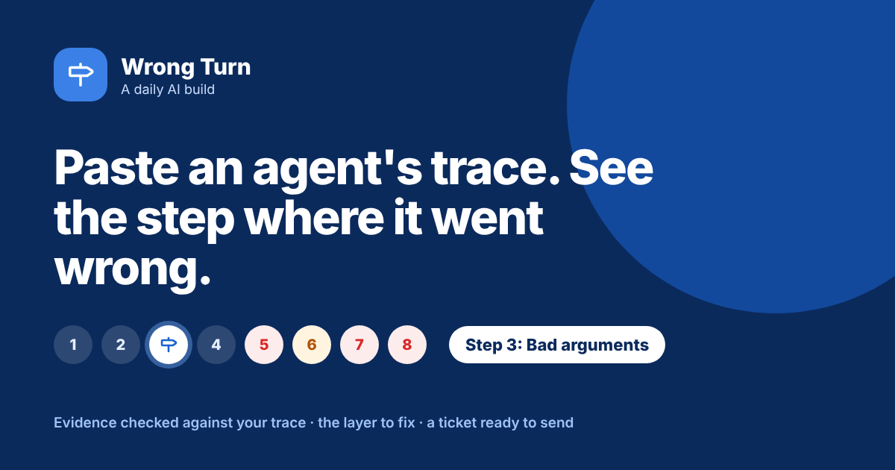

# Wrong Turn

**Paste the trace of an AI agent run that went wrong. See every step, the first one that went wrong, how sure that call is, who usually fixes that kind of problem and a ticket ready to send.**

[Live app](https://wrong-turn-trace.vercel.app) · Three worked examples run without a key



---

## The problem

When an agent fails, the failure gets reported where the user saw it. The customer was told a refund went through. The research came back empty. The caller was booked on the one day they ruled out. So the fix tends to go there too: a stricter line in the reply prompt, a longer step limit, a reminder to read back the booking.

Most of the time that is the wrong place. The refund was invented because an earlier tool call failed and the agent carried on. The research came back empty because the agent read a blocked page as a slow one and retried it until the budget ran out. The booking went wrong because one agent heard the constraint and the handoff to the next agent left it behind.

The trace usually shows all of this, but reading a trace is slow, and a PM looking at one often has to ask an engineer to walk through it. Wrong Turn reads it with you and points at the step to fix.

## What it does

You paste the trace in whatever form you have it: JSON, an export from a tracing tool, console output or plain text. You add one or two sentences on what the agent should have done, and pick what went wrong as reported and the setup.

| | |
| --- | --- |
| **The scan** | Before any model runs, fixed patterns flag error lines and repeated calls in your trace as you paste |
| **Step by step** | The run as a timeline. Every step has a status, a problem if it has one, its lines from your trace and a quote checked against the trace. Click a step, change its status or problem, and everything downstream follows |
| **The wrong turn** | The first step that went wrong, its confidence, whether the failure reached the user and how many later steps followed from it |
| **Where the fix goes** | The layer behind that kind of problem (prompt, tool schema, error handling, handoff contract and so on) and who usually owns it |
| **Fix, confirm, prevent** | The fix, a check that confirms the cause before anyone changes code, and an eval case so the same wrong turn cannot quietly come back |
| **Scan signals** | Every error line and loop, with the step that explains it, or a warning that nothing does |
| **A ticket** | The whole thing as Markdown, to copy or download into a ticket or a message to engineering |

## The design choice that matters

**A model reads. Rules decide.** Which step gets blamed should not change with the wording of a prompt, and a model asked "what was the root cause?" will often name the most visible failure. So the model only splits the trace into steps and describes each one from fixed word lists, with a quote from the trace as evidence. Picking the wrong turn, checking the evidence and setting the confidence all happen in the browser with printed rules.

The rules also check the model. Every quote it gives is searched for in your trace, word for word. The scan runs on your raw text without any model, and any error signal that no flagged step explains is surfaced and can lower the confidence.

This is the same split as Who Says Yes?, Pass the Call and Who Does What? in this repo.

## How the wrong turn is picked

The model gives each step a status (Fine, Suspect or Failed) and a problem from a list of twelve. A tool that honestly reports an error is Fine; the step that mishandles the error is where the problem goes.

| Rule | What it does |
| --- | --- |
| **W1** | The first step that is not Fine and has a problem is the wrong turn. Later ones are listed as what followed |
| **C1** | The step's quote is searched for in your trace. Found word for word or not |
| **C2** | Made up a fact, repeated itself and stopped too early usually follow an earlier mistake. One level lower |
| **C3** | An error signal from the scan, before the wrong turn, that no flagged step explains. One level lower |
| **C4** | A problem you typed yourself has no playbook. One level lower |

Confidence starts at **High** (Failed, quote found), **Medium** (Failed without a found quote, or Suspect with one) or **Low** (Suspect, quote not found), then drops for each of C2 to C4. It never goes below Low.

The scan has three rules: **S1** error words (error, exception, failed, timeout, forbidden, not found, rate limit, invalid), **S2** HTTP 4xx and 5xx status codes, and **S3** the same tool call three or more times once timestamps and step numbers are stripped.

## The twelve problems

| Problem | Layer | Usually fixed by |
| --- | --- | --- |
| Wrong tool chosen | Tool descriptions | Whoever writes the prompt and tool list |
| Bad arguments | Tool schema | The engineer who owns the tool |
| Tool or API failed | The tool or API | The team that runs the service |
| Error ignored | Error handling | The agent loop owner, with the prompt owner |
| Result misread | Prompt | The prompt owner |
| Missing context | Context passing | The engineer who builds the agent context |
| Instruction ignored | Prompt | The prompt owner |
| Retrieved wrong source | Retrieval | The search index or data owner |
| Handoff dropped context | Handoff contract | The owners of both agents |
| Made up a fact | Grounding | The prompt owner, with a check in the loop |
| Repeated itself | Loop control | The agent loop owner |
| Stopped too early | Loop control | The agent loop owner |

Each one carries a plain description, a fix and a check that confirms the cause. Several of them (tool descriptions, prompt wording, what a result means) can be fixed and tested by a PM without pulling in engineering.

## Worked examples

| Example | Where the user noticed | Where it went wrong |
| --- | --- | --- |
| **The refund that never happened** (customer support) | Step 9: the agent tells the customer the refund is processed | Step 3: the order id went to the lookup tool with a hash sign. Tool schema. High confidence |
| **Twelve steps, one blocked page** (research agent) | Step 8: "I wasn't able to complete the research in time" | Step 5: a 403 from bot protection read as a page still loading. Prompt. High confidence |
| **Booked on the one day they ruled out** (voice booking) | Step 8: the caller objects to a Monday booking | Step 3: the handoff carried intent, service and name but not "no Mondays". Handoff contract. Medium confidence, and the scan finds nothing at all, which is the point |

Each loads a saved trace and a saved model reply and runs through the same rules as a live read.

## Where the method comes from

Reading a run as a list of steps follows how agent tracing tools lay out a trace, with each model call, tool call and handoff as its own span. The twelve problems, their layers and the fixes are my own working list from running conversational and voice agents in production, where the place a customer noticed a failure was rarely where it started. They are not an industry standard. Step splits, statuses, quotes and links are the model's suggestions and should be checked against the trace; the quote check catches invented evidence, not wrong judgement.

## What it does not do

- It only sees what the trace logged. If the system prompt or the retrieved text is missing from the log, so is the cause.
- One run is one example. Check whether the same wrong turn shows up across runs before rewriting anything.
- The owner line is the usual owner, not your org chart.
- The scan matches words. It will flag a user who types "error" and miss an error worded politely.

## Model and privacy

The step list runs on **Muse Glimmer** through NVIDIA's free endpoint by default, on the site's own key. Visitors can switch to Anthropic, OpenAI or Gemini with their own key, which is sent with that one request and never stored. Nothing pasted is saved. Traces often hold customer data, so strip names, emails and ids before pasting. The prompt and the site key live in a serverless function, not in the browser bundle. The function numbers every trace line before the model sees it, so the model can give line ranges the browser can check. Output comes back as tagged lines rather than JSON, which keeps the provider swap cheap.

## Run it locally

```bash
npm install
npx vercel dev
```

Set these environment variables for the default model:

```
LLM_BASE_URL=https://integrate.api.nvidia.com/v1
LLM_MODEL=<Muse Glimmer model id>
LLM_API_KEY=<your NVIDIA key>
```

Without them, the worked examples still run, and visitors can bring their own key.

## Stack

React and Vite, deployed on Vercel. One serverless function (`api/read.js`). The scan, the evidence check, the wrong-turn rules, the playbook and the ticket export live in `src/trace.js`. Icons from Lucide.

---

Part of [Daily AI Builds](../) by Prerna Kakkar.
